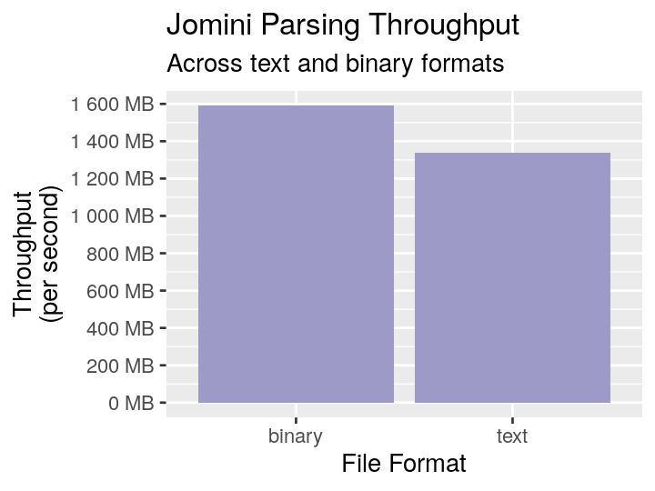

 [](https://docs.rs/jomini) [](https://crates.io/crates/jomini)

# Jomini

A low level, performance oriented parser for save and game files from [Paradox Development Studio](https://en.wikipedia.org/wiki/Paradox_Development_Studio) titles (eg: Europa Universalis (EU4), Hearts of Iron (HOI4), and Crusader Kings (CK3), Imperator, Stellaris, and Victoria).

For an in-depth look at the Paradox Clausewitz format and the pitfalls that come
trying to support all variations, consult [the write-up](https://pdx.tools/blog/a-tour-of-pds-clausewitz-syntax). In short, it's extremely difficult to write a robust and
fast parser that abstracts over the format difference between games as well as differences between game patches. Jomini hits the sweet spot between flexibility while still being ergonomic.

Jomini is the cornerstone of the [online EU4 save file
analyzer](https://pdx.tools). This library also powers the [Paradox Game
Converters](https://github.com/ParadoxGameConverters) and
[pdxu](https://github.com/crschnick/pdx_unlimiter).

## Features

- ✔ Versatile: Handle both plaintext and binary encoded data
- ✔ Fast: Parse data at over 1 GB/s
- ✔ Small: Compile with zero dependencies
- ✔ Safe: Extensively fuzzed against potential malicious input
- ✔ Ergonomic: Use [serde](https://serde.rs/derive.html)-like macros to have parsing logic automatically implemented
- ✔ Embeddable: Cross platform native apps, statically compiled services, or in the browser via [Wasm](https://webassembly.org/)

## Quick Start

Below is a demonstration on parsing plaintext data using jomini tools.

```rust
use jomini::{JominiDeserialize, TextDeserializer};

#[derive(JominiDeserialize, PartialEq, Debug)]
pub struct Model {
    human: bool,
    first: Option<u16>,
    #[jomini(alias = "forth")]
    fourth: u16,
    #[jomini(alias = "core", duplicated)]
    cores: Vec<String>,
    names: Vec<String>,
}

let data = br#"
    human = yes
    forth = 10
    core = "HAB"
    names = { "Johan" "Frederick" }
    core = FRA
"#;

let expected = Model {
    human: true,
    first: None,
    fourth: 10,
    cores: vec!["HAB".to_string(), "FRA".to_string()],
    names: vec!["Johan".to_string(), "Frederick".to_string()],
};

let actual: Model = TextDeserializer::from_windows1252_slice(data)?;
assert_eq!(actual, expected);
```

## Binary Parsing

Parsing data encoded in the binary format is done in a similar fashion but with a couple extra steps for the caller to supply:

- How text should be decoded (typically Windows-1252 or UTF-8)
- How rational (floating point) numbers are decoded
- How tokens, which are 16 bit integers that uniquely identify strings, are resolved

Implementors be warned, not only does each Paradox game have a different binary format, but the binary format can vary between patches!

Below is an example that defines a sample binary format and uses a hashmap token lookup.

```rust
use jomini::{BinaryDeserializer, BinaryFlavor, Encoding, JominiDeserialize, Windows1252Encoding};
use std::{borrow::Cow, collections::HashMap};

#[derive(JominiDeserialize, PartialEq, Debug)]
struct MyStruct {
    field1: String,
}

#[derive(Debug, Default)]
pub struct BinaryTestFlavor;

impl BinaryFlavor for BinaryTestFlavor {
    fn visit_f32(&self, data: [u8; 4]) -> f32 {
        f32::from_le_bytes(data)
    }

    fn visit_f64(&self, data: [u8; 8]) -> f64 {
        f64::from_le_bytes(data)
    }
}

impl Encoding for BinaryTestFlavor {
    fn decode<'a>(&self, data: &'a [u8]) -> Cow<'a, str> {
        Windows1252Encoding::decode(data)
    }
}

let data = [ 0x82, 0x2d, 0x01, 0x00, 0x0f, 0x00, 0x03, 0x00, 0x45, 0x4e, 0x47 ];

let mut map = HashMap::new();
map.insert(0x2d82, "field1");

let actual: MyStruct = BinaryDeserializer::builder_flavor(BinaryTestFlavor)
    .from_slice(&data[..], &map)?;
assert_eq!(actual, MyStruct { field1: "ENG".to_string() });
```

When done correctly, one can use the same structure to represent both the plaintext and binary data
without any duplication.

One can configure the behavior when a token is unknown (ie: fail immediately or try to continue).

## Caveats

Caller is responsible for:

- Determining the correct format (text or binary) ahead of time
- Stripping off any header that may be present (eg: `EU4txt` / `EU4bin`)
- Providing the token resolver for the binary format
- Providing the conversion to reconcile how, for example, a date may be encoded as an integer in
  the binary format, but as a string when in plaintext.

## The Mid-level API

If the automatic deserialization via `JominiDeserialize` is too high level, there is a mid-level
api where one can easily iterate through the parsed document and interrogate fields for
their information.

```rust
use jomini::TextTape;

let data = b"name=aaa name=bbb core=123 name=ccc name=ddd";
let tape = TextTape::from_slice(data).unwrap();
let mut reader = tape.windows1252_reader();

while let Some((key, _op, value)) = reader.next_field() {
    println!("{:?}={:?}", key.read_str(), value.read_str().unwrap());
}
```

## One Level Lower

At the lowest layer, one can interact with the raw data directly via `TextTape`
and `BinaryTape`.

```rust
use jomini::{TextTape, TextToken, Scalar};

let data = b"foo=bar";

assert_eq!(
    TextTape::from_slice(&data[..])?.tokens(),
    &[
        TextToken::Unquoted(Scalar::new(b"foo")),
        TextToken::Unquoted(Scalar::new(b"bar")),
    ]
);
```

If one will only use `TextTape` and `BinaryTape` then `jomini` can be compiled without default
features, resulting in a build without dependencies.

## Write API

There are two targeted use cases for the write API. One is when a text tape is on hand.
This is useful when one needs to reformat a document (note that comments are not
preserved):

```rust
use jomini::{TextTape, TextWriterBuilder};

let tape = TextTape::from_slice(b"hello   = world")?;
let mut out: Vec<u8> = Vec::new();
let mut writer = TextWriterBuilder::new().from_writer(&mut out);
writer.write_tape(&tape)?;
assert_eq!(&out, b"hello=world");
```

The writer normalizes any formatting issues. The writer is not able to
losslessly write all parsed documents, but these are limited to truly
esoteric situations and hope to be resolved in future releases.

The other use case is geared more towards incremental writing that can be
found in melters or those crafting documents by hand. These use cases need to
manually drive the writer:

```rust
use jomini::TextWriterBuilder;
let mut out: Vec<u8> = Vec::new();
let mut writer = TextWriterBuilder::new().from_writer(&mut out);
writer.write_unquoted(b"hello")?;
writer.write_unquoted(b"world")?;
writer.write_unquoted(b"foo")?;
writer.write_unquoted(b"bar")?;
assert_eq!(&out, b"hello=world\nfoo=bar");
```

## Unsupported Syntax

Due to the nature of Clausewitz being closed source, this library can never guarantee compatibility with Clausewitz. There is no specification of what valid input looks like, and we only have examples that have been [collected in the wild](https://pdx.tools/blog/a-tour-of-pds-clausewitz-syntax). From what we do know, Clausewitz is recklessly flexible: allowing each game object to potentially define its own unique syntax. It is technically possible for us to support these fringe edge cases in search for perfection, but achieving that goal would sacrifice either ergonomics or performance: two pillars that are a must for save game parsing. Until a suitable solution is presented, a workaround would be to preprocess the unique syntax into a more recognizable format.

The good news is that unsupported syntax is typically isolated in a handful of game files.

Known unsupported syntax:

- ```
    simple_cross_flag = {
        pattern = list "christian_emblems_list"
        color1 = list "normal_colors"
    }
  ```

  Above is an example of an unmarked list found in CK3. Typically lists are use brackets (`{`, `}`) but those are conspicuously missing here.

- ```
    on_actions = {
        faith_holy_order_land_acquisition_pulse
        delay = { days = { 5 10 }}
        faith_heresy_events_pulse
        delay = { days = { 15 20 }}
        faith_fervor_events_pulse
    }
  ```

  Alternating value and key value pairs. Makes one wish they used a bit more of a self describing format. We can parse objects or lists that occur at the end of a container, but are unable to repeatedly switch between the two formats.

- ```
  pride_of_the_fleet = yes definition definition = heavy_cruiser
  ```
  In this instance, the first `definition` should be skipped, but skipping an unrecognized or duplicate field is not consistent across game objects, as we can see from the previous examples where one shouldn't skip fields like this.

## Benchmarks

Benchmarks are ran with the following command:

```
cargo clean
cargo bench -- '/ck3'
find ./target -wholename "*/new/raw.csv" -print0 | xargs -0 xsv cat rows > assets/jomini-benchmarks.csv
```

And can be analyzed with the R script found in the assets directory.

Below is a graph generated from benchmarking on an arbitrary computer.


